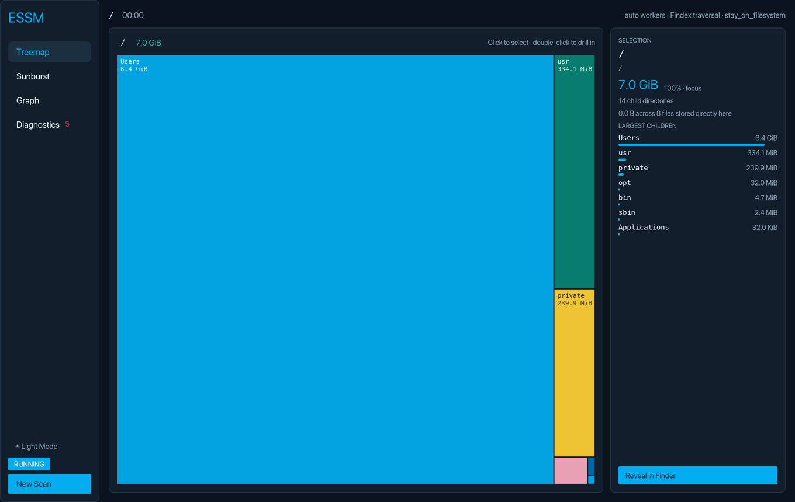

# Enclosed Space Searching Machine

<p align="center">
  
</p>

(Not realtime! Actual time displayed in the top left (~19 sec))

## Build from source

You will need macOS, Erlang/Elixir, a recent Rust toolchain, and the Xcode
Command Line Tools.

From the project directory, use:

```bash
  make            # Build full development stack
  make run        # Build and launch desktop
  make check      # Formatting + strict Clippy
  make test       # All test suites
  make verify     # Check + test
  make release    # Optimized builds and OTP release
  make package    # Build self-contained macOS .app
  make clean      # Remove build outputs
  make help       # List targets
```

### Scan the whole Mac

Use `/` as the root to inspect everything visible to the app. For the most
complete result, grant Full Disk Access to the app or to your terminal in **System Settings → Privacy & Security → Full
Disk Access**.

The scanner stays on the starting filesystem by default. This avoids network
volumes, external disks, special mounted filesystems and duplicate traversal
of macOS's APFS Data volume.


### Displayed size

The app sums the allocated size of regular files. 
That is usually a good indicator of file size on the system, but due to the APFS format
it won't tell you exactly how much space macOS
will reclaim. APFS clones, hard links, snapshots, compression and purgeable
storage can make reclaimable space differ from the displayed total.

## Command-line options

Arguments prefill the scan form providing a root starts the scan immediately.

```text
essm [OPTIONS] [ROOT]

-c, --concurrency N      traversal workers (default: automatic)
    --cross-mounts       cross filesystem and automount boundaries
    --dark               start in dark mode (default: system appearance)
    --anonymize          hide the username in displayed paths
```

Run `essm --help` for development-oriented screenshot, recording, metadata, and
project-location options.

## Development

```sh
(cd rust_client/backend && mix compile)
cargo fmt --check --manifest-path desktop/Cargo.toml
cargo clippy --all-targets --manifest-path desktop/Cargo.toml -- -D warnings
cargo test --manifest-path desktop/Cargo.toml
```

The integration test performs a real scan through the event stream
used by the desktop interface. Engine APIs, internals, and lower-level clients
are documented separately in the [Findex engine README](findex/README.md).
